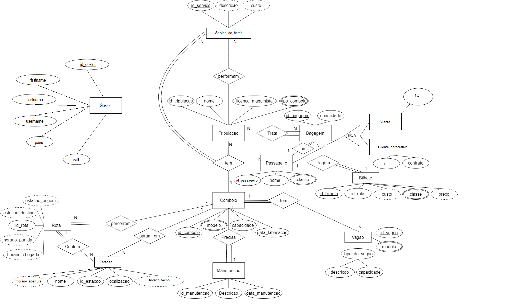
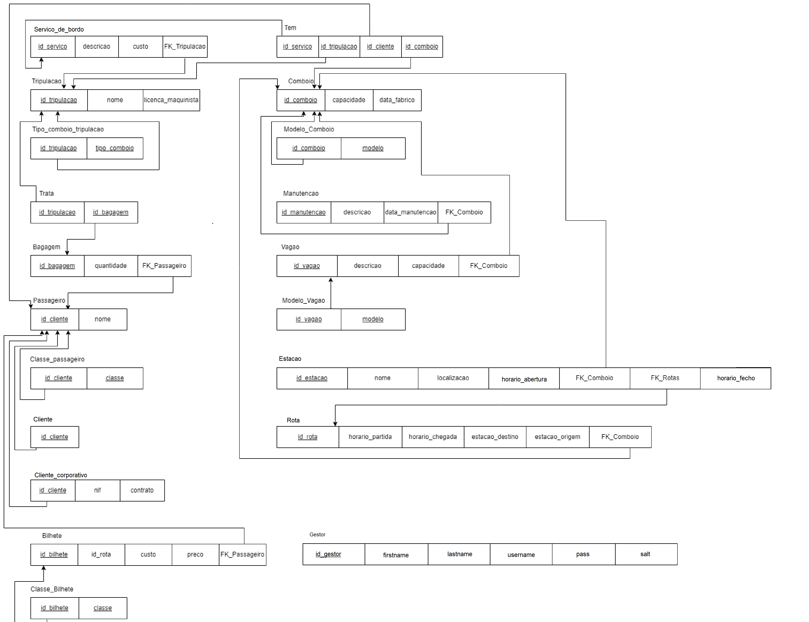
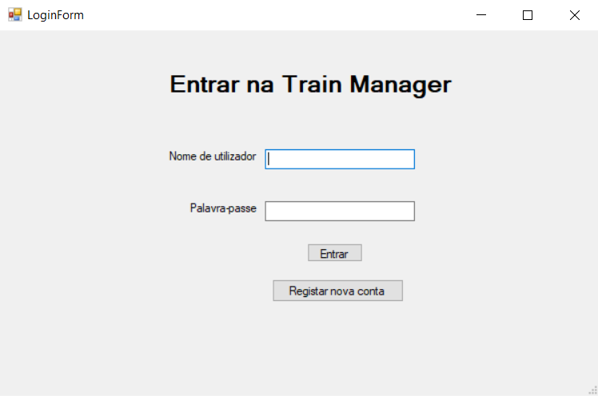
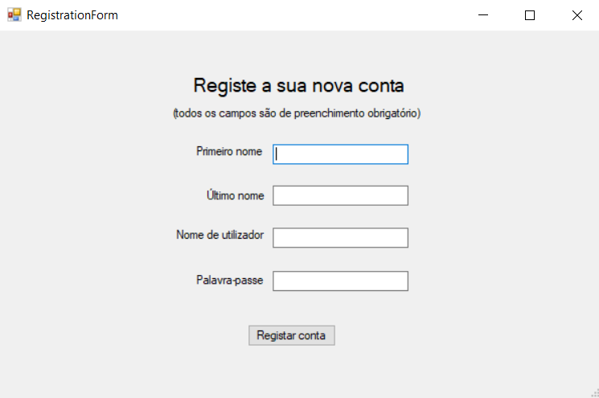
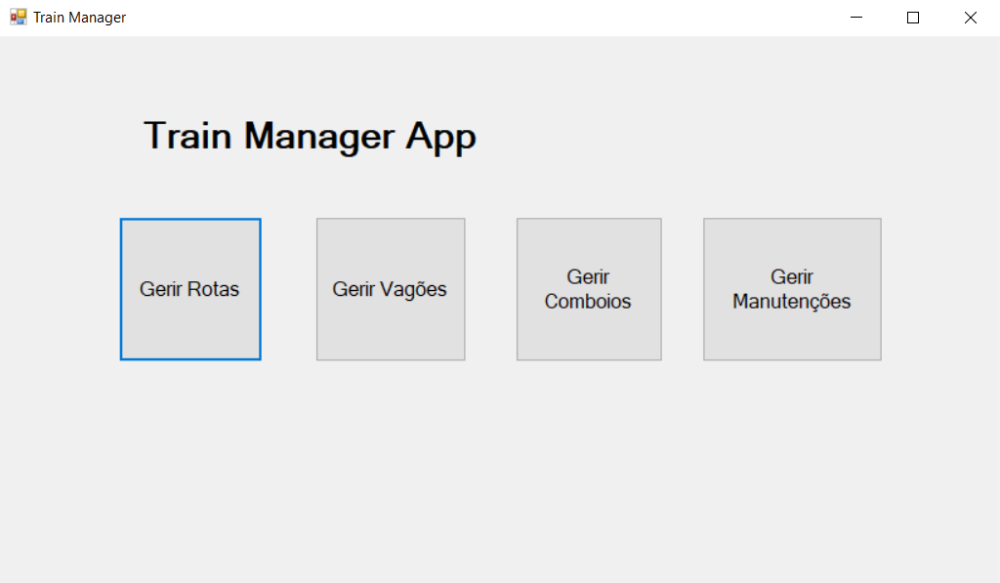
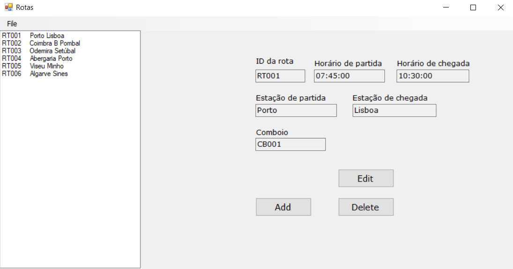
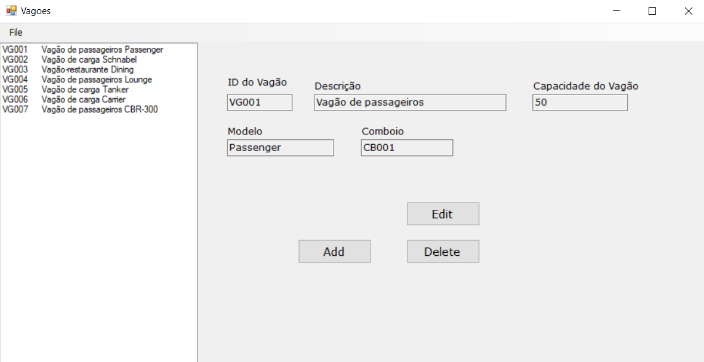
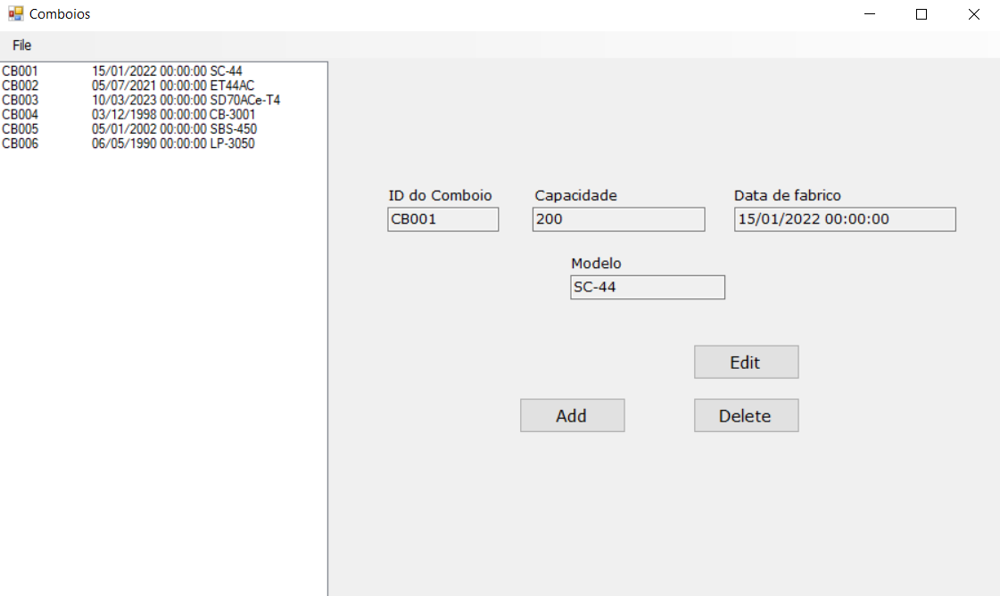
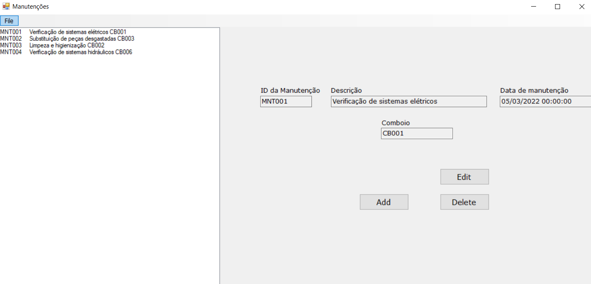

# BD: Trabalho Prático APF-T

**Grupo**: P7G1
- Bruno Gomes, MEC: 103320
- Diogo Silva,  MEC: 104341


## Introdução / Introduction
 
Esta base de dados a baseia-se num Sistema de gestão de comboios, incluíndo os seus vagões, tripulação e passageiros

## ​Análise de Requisitos / Requirements

Quem vai utilizar esta base de dados? Esta base de dados vai ser utilizada principalmente por funcionários da empresa de gestão de comboios.

Principais informações e funções armazenadas: Informações sobre serviços de bordo, informações sobre clientes, bilhetes, tripulação presente no comboio, bagagens, informações sobre o próprio comboio e a manutenção do
mesmo, informações sobre cada vagão integrante do comboio, informações sobre acontecimentos de acidentes/incidentes, informações sobre rotas e estações onde o comboio para.

Relações entre as entidades:
-Um serviço de bordo tem apenas uma tripulação associada a esse serviço;
-N tripulações tratam de M bagagens;
-Um passageiro pode ter N bagagens;
-Um passageiro paga apenas um bilhete;
-Um passageiro pode ser um cliente ou um cliente corporativo;
-Um comboio tem N serviços de bordo;
-Um comboio tem N tripulações;
-Um comboio tem N passageiros;
-Um comboio tem N vagões;
-Um comboio necessita de uma manutenção;
-Um comboio para em N estações;
-Um comboio percorre N rotas;
-Uma rota pode ter N estações associadas.

Restrições de integridade: Um cliente não pode comprar bilhete para um comboio que já tenha partido, um vagão só pode ser atribuído a um comboio, não pode haver bilhetes sem clientes associados, não podem existir comboios sem manutenção feita, o horário de partida tem de ser sempre "menor" que o horário de chegada.

Regras de acesso e segurança: Só os funcionários e responsáveis pela gestão da base de dados podem ter acesso á própria. 

## DER - Diagrama Entidade Relacionamento/Entity Relationship Diagram

### Versão final/Final version



### APFE 

- Todos os nomes das Endidades foram passadas para singular.

- Eliminamos a entidade de desastres.

- A entidade comboio passou a ter uma relação fraca para com a entidade vagão

- O atributo id_cliente da entidade Passageiro, passou a ser chamado id_passageiro

- O atributo horario_funcionamento da entidade Estacao, foi dividido nos atributos horario_abertura e horario_fecho

- Foi criada uma nova entidade para registar os dados de login à base de dados

## ER - Esquema Relacional/Relational Schema

### Versão final/Final Version



## ​SQL DDL - Data Definition Language

[SQL DDL File](sql/01_ddl.sql "SQLFileQuestion")

## SQL DML - Data Manipulation Language


### Login Form



```sql
-- Get user
SELECT pass, salt FROM train.Gestor WHERE username = @Username;
```

### Register Form



```sql
--Insert User
INSERT INTO train.Gestor (firstname, lastname, username, pass, salt) VALUES (@firstName, @lastName, @username, @password, @salt);
```

### Train Manager App Form



### Gerir Rotas Form


```sql

-- Load Rota Table
SELECT * FROM train.Rota

-- Insert Rota
INSERT train.Rota (id_rota, horario_partida, horario_chegada, estacao_partida, estacao_chegada, FK_Comboio) " + "VALUES (@id_rota, @horario_partida, @horario_chegada, @estacao_partida, @estacao_chegada, @FK_Comboio)

-- Update Rota
UPDATE train.Rota " + "SET horario_partida = @horario_partida, " + "    horario_chegada = @horario_chegada, " + "    estacao_partida = @estacao_partida, " + "    estacao_chegada = @estacao_chegada, " + "    FK_Comboio = @FK_Comboio "  + "WHERE id_rota = @id_rota

-- Delete Rota
DELETE train.Rota WHERE id_rota=@id_rota
```

### Gerir Vagões Form



```sql
-- Load Vagões Table
SELECT train.Vagao.id_vagao, descricao, capacidade, FK_Comboio, modelo FROM train.Vagao, train.Modelo_vagao WHERE  train.Vagao.id_vagao = train.Modelo_vagao.id_vagao;

-- Insert Vagão
INSERT INTO train.Vagao (id_vagao, descricao, capacidade, FK_Comboio)  +
                              VALUES (@id_vagao, @descricao, @capacidade, @FK_Comboio)

-- Update Vagão
"UPDATE train.Vagao " +
                    "SET descricao = @descricao, capacidade = @capacidade, FK_Comboio = @FK_Comboio " +
                    "WHERE id_vagao = @id_vagao";

-- Remove Vagão
DELETE FROM train.Modelo_vagao WHERE id_vagao = @id_vagao
```

### Gerir Comboios Form



```sql

-- Load Comboio Table
SELECT train.Comboio.id_comboio, capacidade, data_fabrico, modelo FROM train.Comboio, train.Modelo_Comboio WHERE train.Comboio.id_comboio = train.Modelo_Comboio.id_comboio;

-- Insert Comboio
"INSERT INTO train.Comboio (id_comboio, capacidade, data_fabrico) " +
                              "VALUES (@id_comboio, @capacidade, @data_fabrico)";

"INSERT INTO train.Modelo_Comboio (id_comboio, modelo) " +
                                  "VALUES (@id_comboio, @modelo)";

-- Update Comboio
"UPDATE train.Comboio " +
                    "SET capacidade = @capacidade, data_fabrico = @data_fabrico " +
                    "WHERE id_comboio = @id_comboio";

 "UPDATE train.Modelo_Comboio " +
                    "SET modelo = @modelo " +
                    "WHERE id_comboio = @id_comboio";

-- Remove Comboio
DELETE FROM train.Modelo_Comboio WHERE id_comboio = @id_comboio

DELETE FROM train.Comboio WHERE id_comboio = @id_comboio
```

### Gerir Manutenções Form



```sql

-- Load Manutenção
SELECT * FROM train.Manuntencao

-- Insert Manutenção
INSERT train.Manuntencao (id_manuntencao, descricao, data_manuntencao, FK_Comboio) " + "VALUES (@id_manuntencao, @descricao, @data_manuntencao, @FK_Comboio)

-- Update Manutenção
UPDATE train.Manuntencao " + "SET descricao = @descricao, " + "    data_manuntencao = @data_manuntencao, " + "    FK_Comboio = @FK_Comboio " + "WHERE id_manuntencao = @id_manuntencao

-- Remove Manutenção
DELETE train.Manuntencao WHERE id_manuntencao=@id_manuntencao

```

## Normalização/Normalization

Achamos que a base de dados não precisasse de ser mais normalizada pois as tabelas já tinham entidades específcas com os seus atributos e as relações entre as tabelas estavam bem estabelecidas evitando a duplicação de dados

## Índices/Indexes

Criamos Indexes para tabelas de junção e tabelas vindas de atributos multivalor.

```sql
--INDEXES
--Criar Index para os atributos de train.Trata porque era uma junction table

CREATE INDEX idx_trata_id_tripulacao ON train.Trata (id_tripulacao);
CREATE INDEX idx_trata_id_bagagem ON train.Trata (id_bagagem);

--Criar Index para os atributos de train.Classe_passageiro porque vem de um atributo multivalor

CREATE INDEX idx_classe_passageiro_id_passageiro ON train.Classe_passageiro (id_passageiro);

--Criar Index para os atributos de train.Classe_bilhete porque vem de um atributo multivalor

CREATE INDEX idx_classe_bilhete_id_bilhete ON train.Classe_Bilhete (id_bilhete);

--Criar Index para os atributos de train.Modelo_Comboio porque vem de um atributo multivalor

CREATE INDEX idx_modelo_comboio_id_comboio ON train.Modelo_Comboio (id_comboio);

--Criar Index para os atributos de train.Modelo_Vagao porque vem de um atributo multivalor

CREATE INDEX idx_modelo_vagao_id_vagao ON train.Modelo_Vagao (id_vagao);
```

## SQL Programming: Stored Procedures, Triggers, UDF

[SQL SPs and Functions File](sql/02_sp_functions.sql "SQLFileQuestion")

[SQL Triggers File](sql/03_triggers.sql "SQLFileQuestion")

## Outras notas/Other notes

### Dados iniciais da dabase de dados/Database init data

[Indexes File](sql/04_db_init.sql "Iniciador de dados")

### Indexes, Drop de tabelas, Queries e Views.

[Outros dados](sql/05_any_other_matter.sql "Outros dados")


 