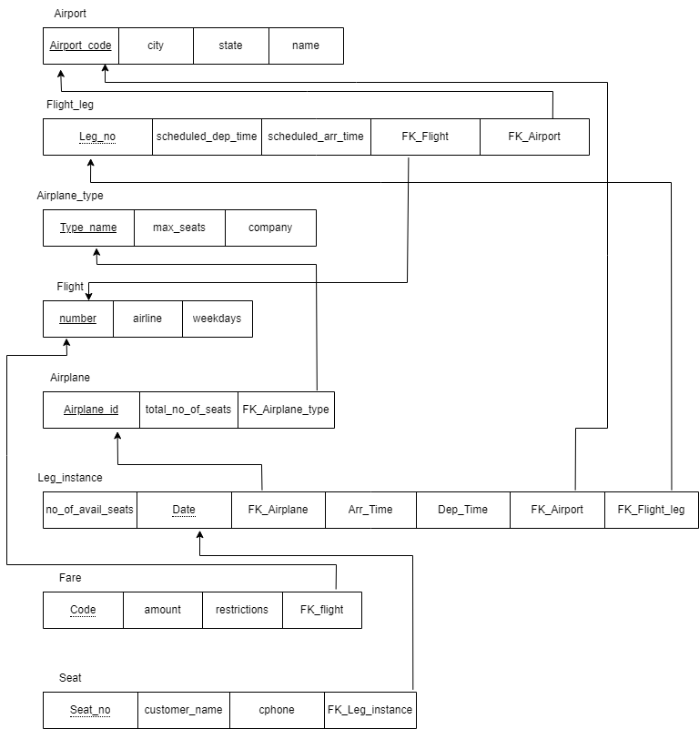

# BD: Guião 3

## ​Problema 3.1
 
### *a)*

**Tabelas:**

- Cliente
- Aluguer
- Balcão
- Veiculo
- Tipo\_Veiculo
- Ligeiro
- Pesado
- Similaridade

### *b)* 

**Chaves:**

- Cliente
  - NIF (Primária, Candidata)
  - Num\_carta (Candidata)
  - Endereço (Candidata)
  - Nome (Candidata)
- Aluguer
  - Número (Primária, Candidata)
  - duração (Candidata)
  - data (Candidata)
  - FK\_Cliente (Estrangeira)
  - FK\_Balcao (Estrangeira)
  - FK\_Veículo(Estrangeira)
- Balcão
  - Número (Primária, Candidata)
  - Endereço (Candidata)
  - Nome (Candidata)
- Veículo
  - Matrícula (Primária, Candidata)
  - Marca (Candidata)
  - Ano (Candidata)
  - FK\_TipoVeículo (Estrangeira)

- Tipo\_Veículo
  - Código (Primária, Candidata)
  - Arcondicionado (Candidata)
  - Designação (Candidata)
- Ligeiro
  - Numlugares (Primária, Candidata)
  - Portas (Candidata)
  - Combustível (Candidata)
  - Código (Estrangeira)
- Pesado
  - Peso (Primária, Candidata)
  - Passageiros (Candidata)
  - Código (Estrangeira)
- Similaridade
  - Cod1 (Estrangeira)
  - Cod2 (Estrangeira)

### *c)* 

## ​Problema 3.2

### *a)*

**Tabelas:**

- Airport
- Flight\_leg
- Airplane\_type
- Flight
- Airplane
- Leg\_instance
- Fare
- Seat

### *b)* 

**Chaves:**

- Airport
  - Airport\_code (Primária, Candidata)
  - city (Candidata)
  - state (Candidata)
  - name (Candidata)
- Flight\_leg
  - Leg\_no (Primária, Candidata)
  - Scheduled\_dep\_time (Candidata)
  - Scheduled\_arr\_time (Candidata)
  - FK\_Flight (Estrangeira)
  - FK\_Airport (Estrangeira)
- Airplane\_Type
  - Type\_name (Primária, Candidata)
  - Max\_seats (Candidata)
  - company (Candidata)
- Flight
  - Number (Primária, Candidata)
  - Airline (Candidata)
  - weekdays (Candidata)

- Airplane
  - Airplane\_id (Primária, Candidata)
  - Total\_no\_of\_seats (Candidata)
  - FK\_Airplane\_type (Estrangeira)
- Leg\_instance
  - No\_of\_avail\_seats (Candidata)
  - Date (Primária, Candidata)
  - FK\_airplane (Estrangeira)
  - Arr\_time (Candidata)
  - Dep\_time(Candidata)
  - FK\_Airport(Estrangeira)
  - FK\_Flight\_leg(Estrangeira)
- Fare
  - Code (Primária, Candidata)
  - Amount (Candidata)
  - Restrictions(Candidata)
  - FK\_Flight(Estrangeira)
- Seat
  - Seat\_no(Primária, Candidata)
  - Customer\_name(Candidata)
  - Cphone(candidata)
  - FK\_Leg\_instance(Estrangeira)

### *c)* 

## ​Problema 3.3

### *a)* 2.1

### *b)* 2.2

### *c)* 2.3

### *d)* 2.4

